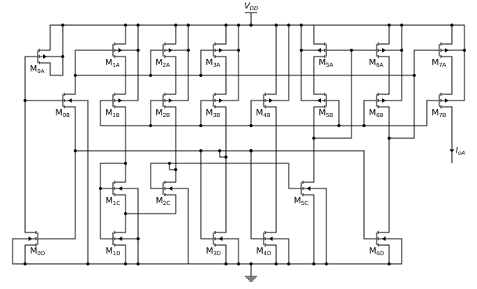
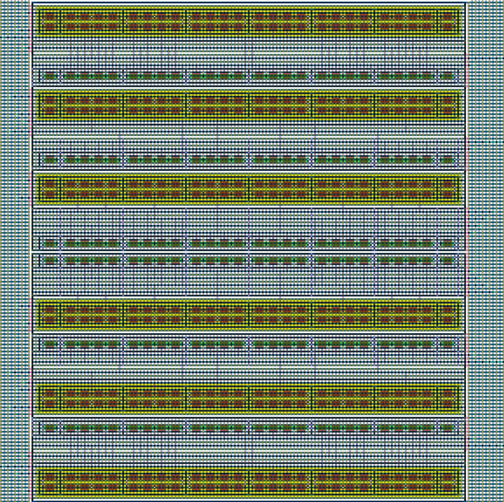
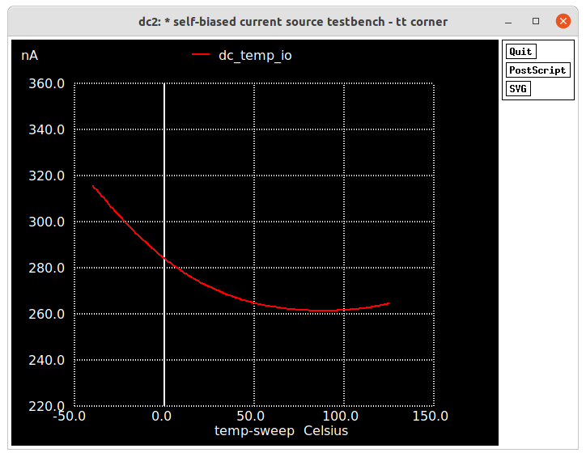
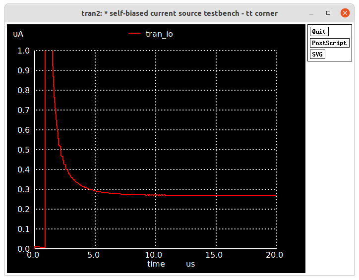

A <b>resistorless self-biased current source</b> intended to be integrated in the efabless MPW4.  

Table of contents
==============================
<!--ts-->
  * [Summary](#Summary)
  * [Description](#Description)
    * [Schematics and Layouts](#Schematics-and-Layouts)
    * [Simulation Results](#Simulation-Results)
  * [Team Members](#Team-Members)  
  * [References](#References)
<!--te-->

---
Summary
=======

Most, if not all, analog integrated circuits are limited by their reference voltage and current sources. This project aims to provide a current source reference with the lowest power consumption and supply voltage possible for this technology.

A conventional gm-constant self-biased current source uses integrated resistors, which can be very large for very low current consumption. Besides that, the integrated resistor creates another independent variable of process variability in addition to the active components. A CMOS only current source process variability is a function of only the active components.

The proposed self-biased current source is based on the topology introduced by Francisco Serra-Graells and Jose Luis Huertas in "Sub-1-V CMOS proportional-to-absolute temperature references" [1], with the addition of high-swing cascode and series-parallel current mirrors [2].

### Target Performance Summary

| Specifications        | -                            |
| :---                  | :---                         |
| VDD                   | 1.0-1.8 V                    |
| Total current         | 3.60 &mu;A                   |
| Output current        | 0.27 &mu;A                   |
| Temperature stability | 0.5 %/V                      |
| Supply stability      | 1160 ppm/°C                  |
| Area                  | 100 x 60 &mu;m²              |

---
Description
===========

### Schematics and Layouts
---

Self-biased current source circuit diagram

### Simulation Results

#### TT corner

Status and Issues
============

* There are no schematics. All simulations are from extracted netlists.
* This project also contains a CMOS only voltage reference based on the main current-source, but there is no documentation available.
* There is a second version of the same current source, but using high-voltage transistors. Only the layer types were replaced.
* Documentation is extremely incomplete.

Team members
============

**Ph.D. Luís Henrique Rodovalho (Rodovalho)**
| [luishenriquerodovalho@gmail.com](mailto:luishenriquerodovalho@gmail.com?subject=Hi% "Hi!")  | 

References
==========

[1] Serra-Graells, Francisco, and Jose Luis Huertas. "Sub-1-V CMOS proportional-to-absolute temperature references." IEEE Journal of Solid-State Circuits 38.1 (2003): 84-88.

[2] Arnaud, Alfredo, Rafaella Fiorelli, and Carlos Galup-Montoro. "Nanowatt, sub-nS OTAs, with sub-10-mV input offset, using series-parallel current mirrors." IEEE Journal of Solid-State Circuits 41.9 (2006): 2009-2018.

