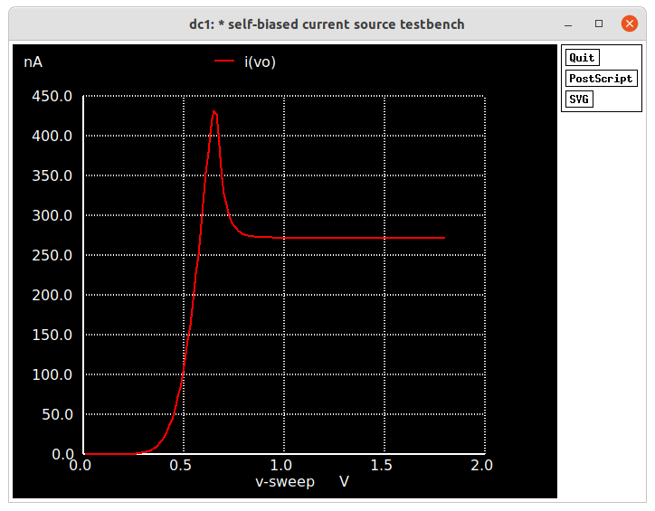
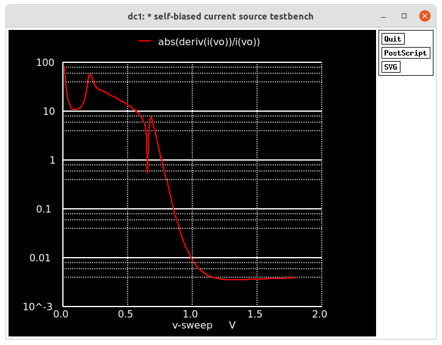

A <b>resistorless self-biased current source</b> intended to be integrated in the efabless MPW4.  

Table of contents
==============================
<!--ts-->
  * [Summary](#Summary)
    * [Motivation](#Motivation)
  * [Description](#Description)
    * [Block Diagram](#Block-Diagram)
    * [Schematics and Layouts](#Schematics-and-Layouts)
    * [Simulation Results](#Simulation-Results)
    * [Target Performance Summary](#Target-Performance-Summary)
  * [Team Members](#Team-Members)  
  * [References](#References)
<!--te-->

---
Description
===========

---

Self-biased current source circuit diagram

### Simulation Results

### TT corner

### Target Performance Summary

| Specifications        | -                            |
| :---                  | :---                         |
| VDD                   | 1.0-1.8 V                    |
| Total current         | 3.50 &mu;A                   |
| Output current        | 0.27 &mu;A                   |
| Temperature stability | 1.0 %/V                      |
| Supply stability      | 3000 ppm/°C                  |

Summary
=======

Status and Issues
============

* Documentation is extremely incomplete.

Team members
============

**Ph.D. Luís Henrique Rodovalho (Rodovalho)**
| [luishenriquerodovalho@gmail.com](mailto:luishenriquerodovalho@gmail.com?subject=Hi% "Hi!")  | 

